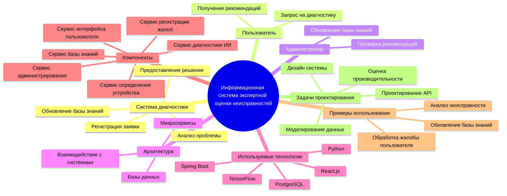
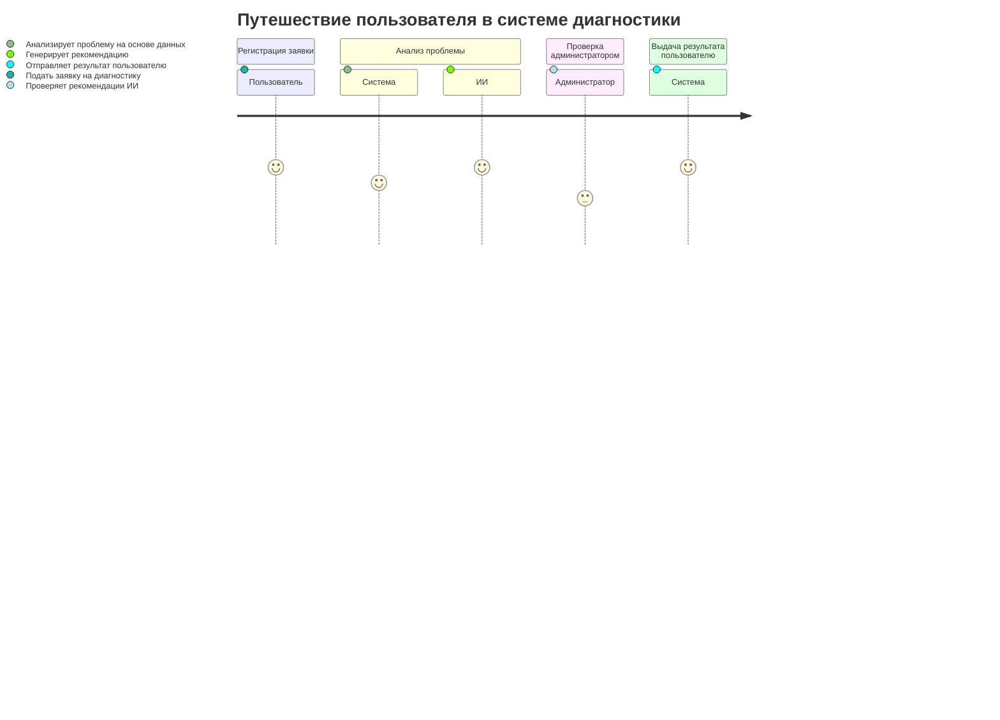
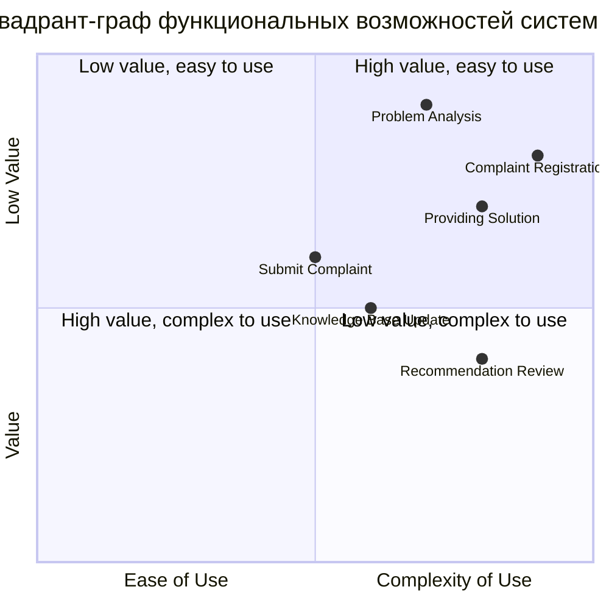
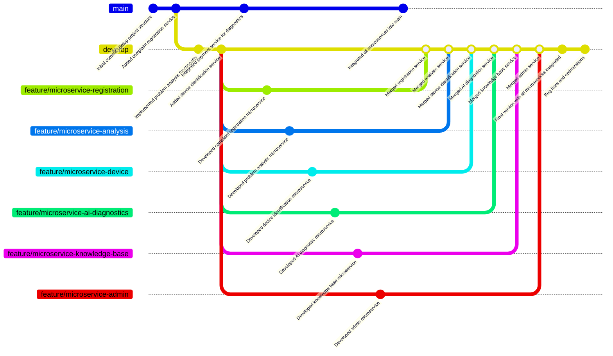

# mermaid-practice-12
# Информационная система экспертной оценки неисправностей компьютера

## Описание

Это информационная система, предназначенная для диагностики неисправностей компьютеров с использованием искусственного интеллекта. Система обрабатывает заявки пользователей, анализирует неисправности на основе базы знаний и предоставляет рекомендации. Администратор проверяет рекомендации и обновляет базу знаний для улучшения точности диагностики.

## Диаграмма структуры функциональных возможностей (Mind Map)

**Описание:**  
Эта диаграмма отображает основные функциональные возможности системы и их взаимосвязи. Включены компоненты системы, такие как сервисы регистрации жалоб, диагностики ИИ и администрирования, а также описание задач проектирования, используемых технологий и примеров использования.

## Диаграмма путешествия пользователя (User Journey)

**Описание:**  
Эта диаграмма иллюстрирует путь пользователя от подачи заявки до получения результатов диагностики.

## Квадрант-граф функциональных возможностей

**Описание:**  
Этот квадрант-граф показывает функциональные возможности системы с точки зрения их ценности и легкости использования.

## Диаграмма Git-репозитория

**Описание:**  
Эта диаграмма отображает процесс разработки системы с использованием Git и включает создание и слияние веток для разработки микросервисов.

